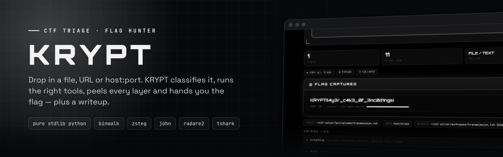
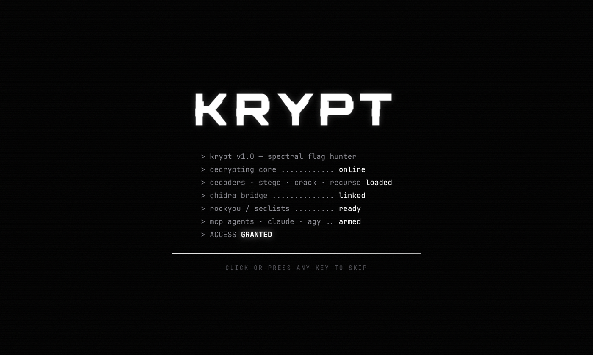
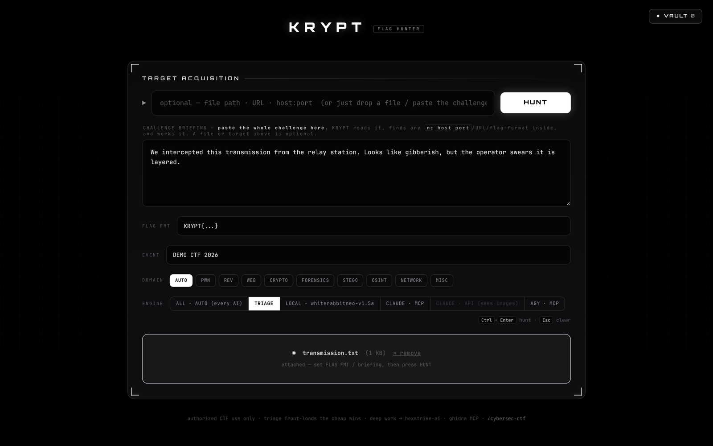
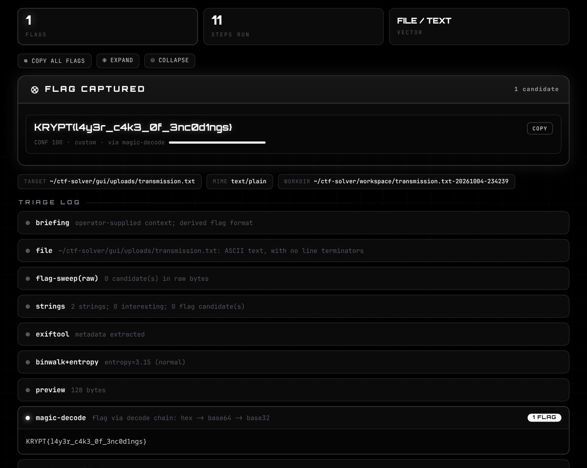
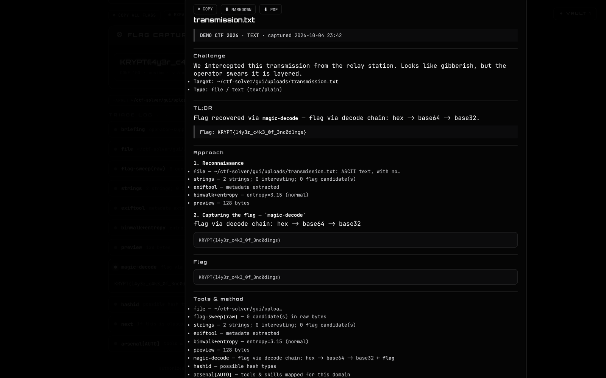
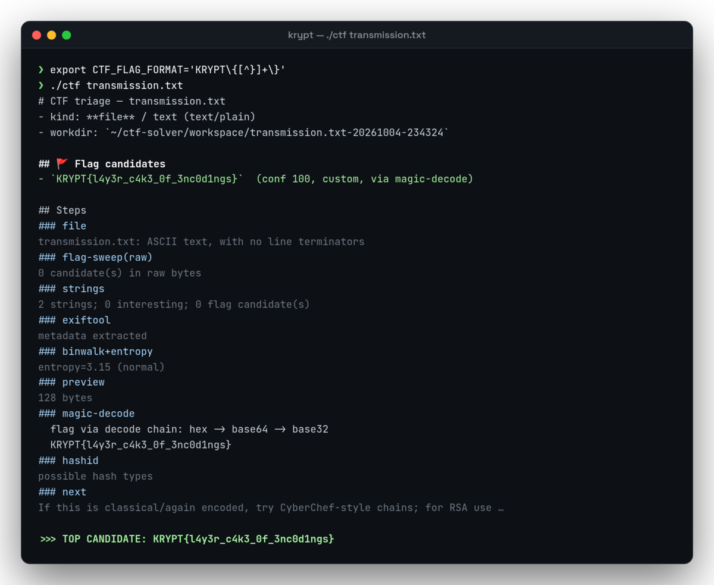
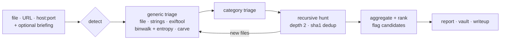

<div align="center">



<br>

[](https://github.com/nithin2719-commits/KRYPT/actions/workflows/tests.yml)
[](#install)
[](#install)
[](LICENSE)

**Give it a file, a URL or a `host:port`. KRYPT works out what kind of challenge it is,
runs the right tools, unwraps every layer it finds, and hands you the flag with a writeup.**

[Screenshots](#screenshots) · [How it works](#how-it-works) · [Install](#install) · [Engines](#engines) · [Vault](#vault--writeups) · [Layout](#layout)

</div>

---

> [!IMPORTANT]
> **Authorized use only.** Point KRYPT at CTF material or at targets you have explicit
> permission to test.

## Why

Most CTF challenges open with the same ten minutes of busywork: `file`, `strings`,
`exiftool`, `binwalk`, try base64, try hex, try rockyou on the zip… KRYPT front-loads all
of those cheap wins into one pass, so your own reasoning (or an agent's) starts only where
the easy answers run out.

- **One input, every tool.** Category is detected automatically. Binaries, images, archives,
  pcaps, ciphertext, web targets and remote services each get their own triage.
- **Peels layers on its own.** A breadth-first "magic" decoder chains base64/32/58/85, hex,
  rot13/47, Caesar, atbash, Morse, gzip/zlib and XOR until a flag shows up.
- **Recursive hunt.** Every carved or extracted file goes back through the full pipeline,
  so nested challenges unravel without you.
- **Reads the challenge text.** Paste the briefing and KRYPT derives the flag format, sweeps
  the text itself for hidden flags, and primes the AI engines with it.
- **Escalates only when it has to.** The default engine runs free deterministic triage first
  and only calls a local model, an MCP agent or the API when the cheap stages come up empty.
- **Writes it up.** Every captured flag is saved to an event with a generated writeup that you
  can export as Markdown or PDF.

## Screenshots

<table>
<tr>
<td width="50%"></td>
<td width="50%"></td>
</tr>
<tr>
<td align="center"><sub><b>Boot.</b> Glitch boot sequence while the backend comes up.</sub></td>
<td align="center"><sub><b>Target acquisition.</b> Attach a file, paste the briefing, set the flag format, pick an engine.</sub></td>
</tr>
</table>



<p align="center"><sub><b>Flag captured.</b> A hex → base64 → base32 chain unwrapped by <code>magic-decode</code>. Every step stays in the triage log.</sub></p>

<table>
<tr>
<td width="55%"></td>
<td width="45%"></td>
</tr>
<tr>
<td align="center"><sub><b>Vault writeup.</b> Generated deterministically, exportable as MD or PDF.</sub></td>
<td align="center"><sub><b>CLI.</b> Same pipeline, same flag, from the terminal.</sub></td>
</tr>
</table>

## How it works



1. **Detect.** `file`/MIME plus URL and host heuristics pick a category.
2. **Generic triage** (every file): `file`, `strings` (ASCII and UTF-16), `exiftool`, `binwalk`
   with entropy, embedded-file extraction, and a flag-regex sweep over the raw bytes *and*
   over every tool's output.
3. **Category triage:**

   | Category | What runs |
   |---|---|
   | binary (pwn / rev) | checksec, readelf, nm/objdump, radare2, ROPgadget, angr, ret2win scaffold |
   | image (stego) | zsteg, steghide, **stegseek + rockyou** |
   | archive | 7z/unzip, detects `Encrypted=+` → **zip2john + rockyou** |
   | pcap | capinfos, tshark, **USB HID keystroke decoder** |
   | pdf | pdftotext, `qpdf --qdf` stream recovery, pdfdetach / pdfimages |
   | text / data (crypto) | **magic BFS decoder**, Caesar brute, single- and repeating-key XOR (crib-based), RSA solver, hashid, auto john |
   | osint | pulls usernames / emails / domains / phones from the briefing and runs sherlock, maigret, holehe, theHarvester, subfinder, phoneinfoga |
   | audio | metadata, strings, steghide on WAV, spectrogram render |
   | url (web) | headers/body, common paths, forms, JWTs, whatweb, optional arjun |
   | host:port | banner grab plus benign auto-probes |

4. **Recursive hunt.** Carved and extracted members are re-run through the full pipeline.
5. **Aggregate.** Candidates are ranked by confidence and the top one is printed.

## Install

The triage core and the GUI are **pure Python standard library**. Nothing to `pip install`
to get started.

```bash
git clone https://github.com/nithin2719-commits/KRYPT.git ~/ctf-solver
cd ~/ctf-solver
./ctf --help
```

KRYPT drives the security tools already on your system: `binwalk`, `exiftool`, `steghide`,
`zsteg`, `john`, `radare2`, `tshark` and so on. Missing ones are skipped. They ship with
BlackArch and Kali, or can be installed with your package manager. The optional autonomous
solvers (angr, pwntools, z3, pycryptodome) are listed in [`requirements.txt`](requirements.txt).

## Usage

**GUI**

```bash
gui/launch.sh          # starts the backend on 127.0.0.1:8777 and opens an app window
```

Type a target, or drop or paste a file anywhere on the window to attach it. Add the
**challenge briefing** and **flag format**, pick an **engine**, then **HUNT** (or
<kbd>Ctrl</kbd>+<kbd>Enter</kbd>). On Hyprland, bind it to a key:

```ini
bind = ALT, T, exec, ~/ctf-solver/gui/launch.sh
```

**CLI**

```bash
./ctf ./challenge.bin            # binary (pwn / rev)
./ctf ./stego.png                # image
./ctf ./capture.pcap             # network
./ctf ./cipher.txt               # crypto / encodings
./ctf https://target/chal        # web
./ctf 10.10.10.5:1337            # remote service
./ctf ./chal --ai                # + local Ollama hypothesis
./ctf ./chal --json              # machine-readable report
```

Pin the event's flag format for precise sweeps:

```bash
export CTF_FLAG_FORMAT='picoCTF\{[^}]+\}'
```

Reports land in `workspace/<name>-<timestamp>/report.{md,json}`.

## Challenge briefing

Paste the challenge prompt and hints into the briefing box, and the flag wrapper into
**FLAG FMT** (or leave it in the briefing). The backend:

- **derives the flag format** (e.g. `picoCTF{…}`) so matches become confidence-100 hits,
- **sweeps the briefing itself** for flags hidden in the prompt, ignoring format
  placeholders like `X{...}`,
- **finds `nc host port` and URLs** in the text and works them, so a file is optional,
- **primes the AI engines** with it as context.

## Engines

| Engine | What it does |
|---|---|
| **ALL · AUTO** *(default)* | Runs every available engine in order, triage → local → Claude MCP → Claude API → agy, and stops at the first real flag. Easy challenges are solved for free and never touch an API. |
| **TRIAGE** | Deterministic pipeline only. Instant, offline, never refuses. |
| **LOCAL · &lt;model&gt;** | Adds a local Ollama hypothesis on your GPU (`ai.py`). Picks an installed security model automatically, falls back to `qwen2.5-coder:7b`; override with `CTF_OLLAMA_MODEL`. |
| **CLAUDE · MCP** | Runs `claude -p` against the challenge with a scoped, read-only MCP allowlist (ghidra, hexstrike-ai). No skip-permissions. |
| **CLAUDE · API** | Calls the Anthropic Messages API directly and **sees the challenge image**, for clues drawn in pixels, QR codes or handwriting. Bring your own key via `ANTHROPIC_API_KEY` or `~/.config/krypt/config.json`; multiple keys rotate by remaining credit. |
| **AGY · MCP** | Hands you a ready-to-run `agy -p` command. It only runs unattended if you opt in with `KRYPT_AGY_YOLO=1`. |

## Vault & writeups

Name your CTF in the **EVENT** field. Every captured flag is saved to that event along with
a generated **writeup** (title, TL;DR, approach, flag, tools, takeaways). It's deterministic,
so no AI tokens are spent. Open **◆ VAULT** to browse events and solves, read writeups, and
export any writeup, or a whole event, as **Markdown** or **PDF**. Storage is plain files
under `vault/`.

## Layout

```
ctf                    CLI launcher
ctfsolver/
  __main__.py          CLI, orchestration, recursive hunt
  detect.py            input classification
  categories.py        domain → tool/skill arsenals
  flags.py             flag-regex sweep (strict mode for noisy sources)
  decoders.py          magic BFS decoder + XOR brute force
  crack.py             rockyou auto-crack (zip / steghide / hash)
  solvers/             angr, pwn scaffold, RSA, brainfuck, text-stego, USB HID
  triage/              per-category modules (binary, image, audio, archive, pcap, pdf, web, osint, …)
  agents.py            claude / agy deep-hunt runners
  ai.py · ai_api.py    local Ollama assist · Anthropic API engine (vision)
  vault.py · export.py events, writeups, Markdown/PDF export
gui/
  server.py            stdlib backend on 127.0.0.1:8777
  index.html           the KRYPT interface
  launch.sh            starts the backend and opens a fullscreen app window
tests/                 decoder, crack, flag, vault, category and solver tests
```

## Tests

```bash
python -m pytest                  # whole suite
python tests/test_decoders.py     # or run one file directly
```

CI runs the suite on every push ([`.github/workflows/tests.yml`](.github/workflows/tests.yml)).

## License

[MIT](LICENSE) © Nithin G
